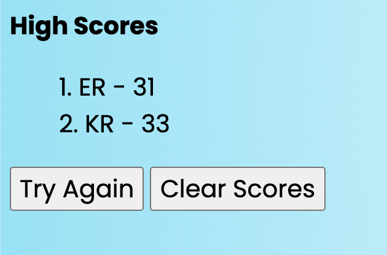

# Code-Quiz
&#x2611; Added a loop function that builds/updates a list element with each entry of initials. (See Example 1)
 
&#x2611; The scoring system is based on the time that's left after the quiz including a 10s penalty for wrong answers.
 
&#x2611; Added an alert that allows users to get engaged to visit the high score page (see Example 2)
 
&#x2611; An example question you will run into to show how the answers are formatted. (see Example 3)

### Example 1

 
 

### Example 2

 
 

### Example 3

 
 

[Deploy to the quiz](https://emmettrr.github.io/Code-Quiz/)